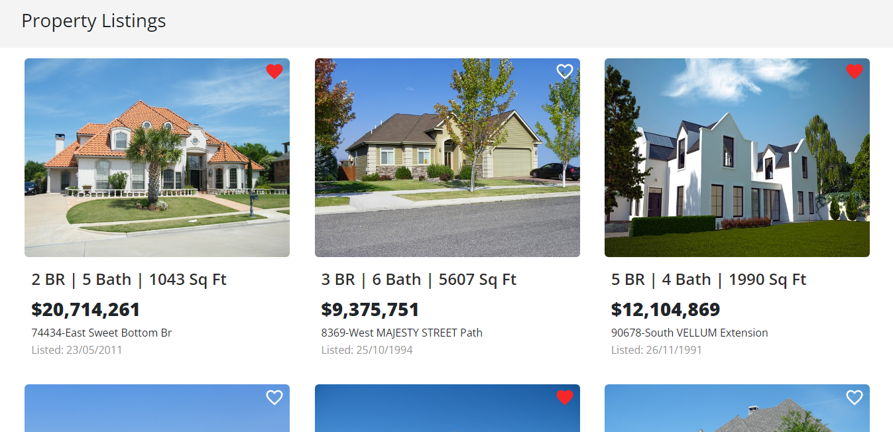
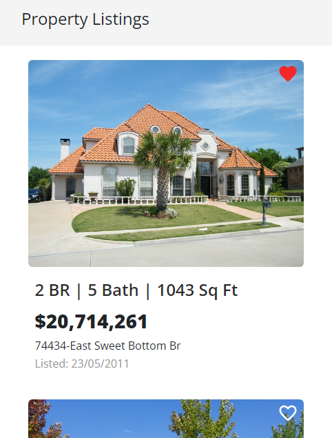

### Kodexo Labs

### :link: https://kodexolab-intern-task.netlify.app/

## Images

## Mobile Responsive Images

## Run Locally

- Run this command `git clone https://github.com/aliaftabsheikh/kodexoLabs-Task.git`
- You are now in the dev environment and you can play around

## Tech Stack

- HTML5
- CSS3
- Javascript
- React js
- Simplyrets API
